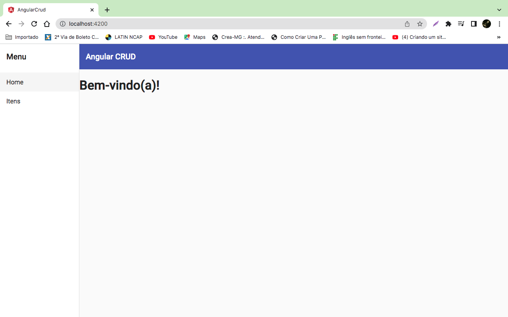
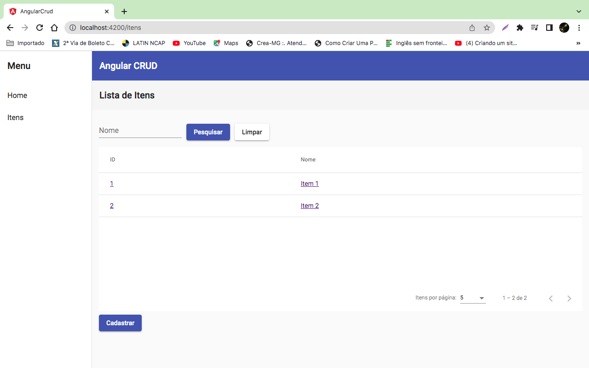
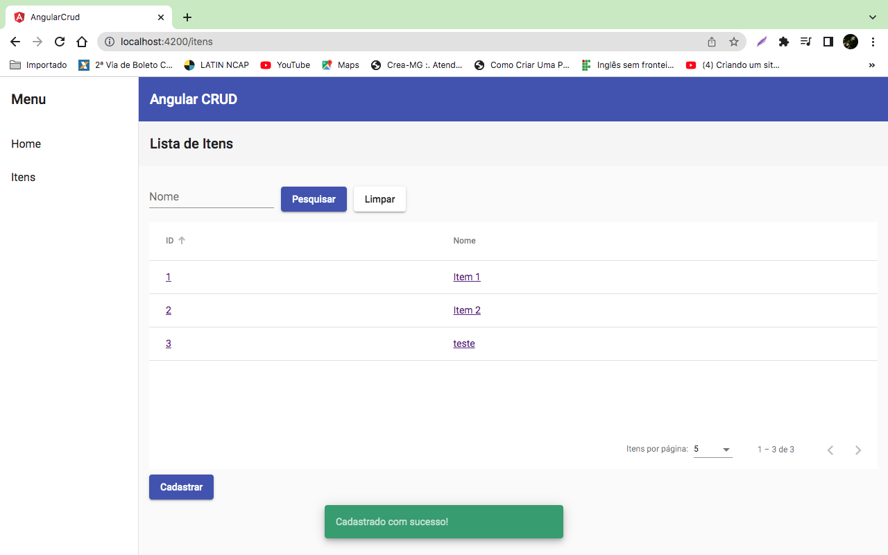
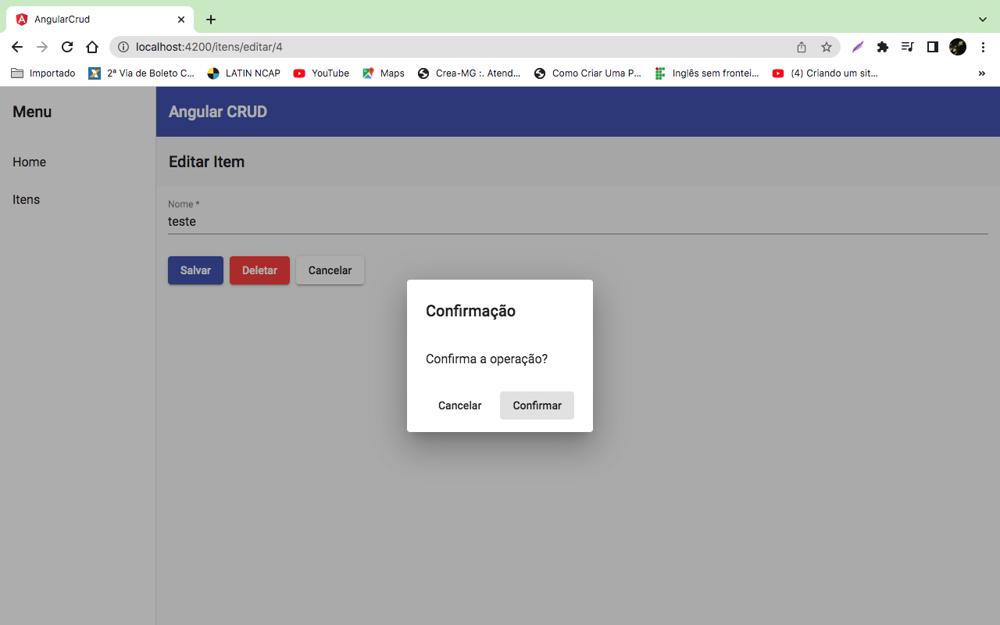

# AngularCrud ##
<p align="center">
  <a href="#dart-about">About</a> &#xa0; | &#xa0; 
  <a href="#rocket-technologies">Technologies</a> &#xa0; | &#xa0;
  <a href="#white_check_mark-requirements">Requirements</a> &#xa0; | &#xa0;
  <a href="#checkered_flag-starting">Starting</a> &#xa0; | &#xa0;
  <a href="https://github.com/chagasleandro" target="_blank">Author</a>&#xa0; | &#xa0;
</p>

<br>

<p align="center">
 

  
</p>

## :dart: About ##
This project was generated with [Angular CLI](https://github.com/angular/angular-cli) version 10.1.0.

## :rocket: Technologies ##

<p>This project was developed using the following technologies:</p>


## :white_check_mark: Requirements ##

Before starting :checkered_flag:, you need to have [Git](https://git-scm.com) and [ANGULAR](https://angular.io/guide/setup-local) installed.

## :checkered_flag: Starting ##
```bash
# cloning this repository
$ git clone https://github.com/chagasleandro/Angular-crud.git
# Acces
$ cd Angular-crud
# Install dependencies
$ npm install
# Run the project
$ ng serve -o
# The server will initialize in the <https://localhost:4200>
```

## Development server

# Acces
$ cd backend
# Install json-server

Install [json-server](https://github.com/typicode/json-server)

```
npm install -g json-server
```

Create a `db.json` file with some data

 ```json
 {  
 	"itens":[  
 	{  
 		"id":1,
 		"nome":"Item 1"
 	},
 	{  
 		"id":2,
 		"nome":"Item 2"
 	}
 	]
 }
 ```
Start JSON Server in back-end folder.

```bash
json-server --watch db.json
```

Now if you go to [http://localhost:3000/itens/1](http://localhost:3000/itens/1), you'll get

```json
{  
    "id":1,
    "nome":"Item 1"
}
```

Then run `ng serve` for a dev server. Navigate to `http://localhost:4200/`. The app will automatically reload if you change any of the source files.






## Build

Run `ng build` to build the project. The build artifacts will be stored in the `dist/` directory. Use the `--prod` flag for a production build.

## Running unit tests

Run `ng test` to execute the unit tests via [Karma](https://karma-runner.github.io).

## Running end-to-end tests

Run `ng e2e` to execute the end-to-end tests via [Protractor](http://www.protractortest.org/).
